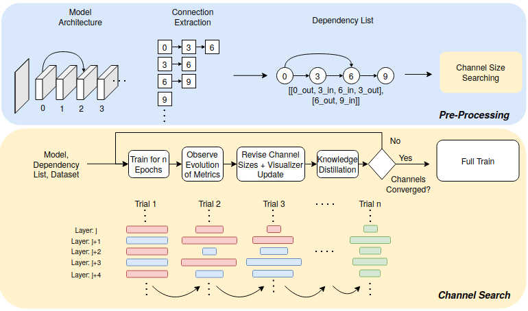
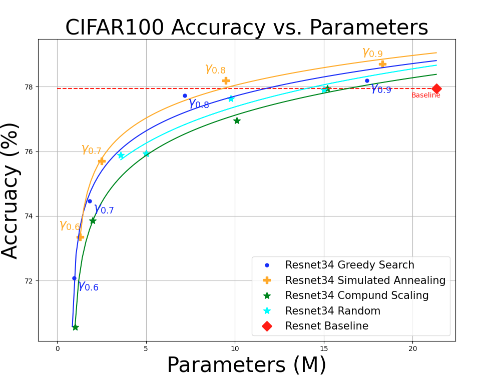
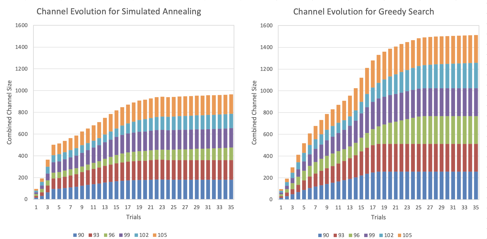

# CONetV2: Efficient Auto-Channel Size Optimization for CNNs


**Exciting News! *CONetV2: Efficient Auto-Channel Size Optimization for CNNs* has been accepted to the International Conference on Machine Learning and Applications (ICMLA) 2021 for Oral Presentation!**


> [**CONetV2: Efficient Auto-Channel Size Optimization for CNNs**](link),            
> Yi Ru Wang, Samir Khaki, Weihang Zheng, Mahdi S. Hosseini, Konstantinos N. Plataniotis        
> *In Proceedings of the IEEE International Conference on Machine Learning and Applications ([ICMLA](https://www.icmla-conference.org/icmla21/))* 

Checkout our arXiv preprint: [Paper](https://arxiv.org/abs/2110.06830)



## Overview

Neural Architecture Search (NAS) has been pivotal in finding optimal network configurations for Convolution Neural Networks (CNNs). While many methods explore NAS from a global search space perspective, the employed optimization schemes typically require heavy computation resources. Instead, our work excels in computationally constrained environments by examining the micro-search space of channel size, the optimization of which is effective in outperforming baselines. In tackling channel size optimization, we design an automated algorithm to extract the dependencies within channel sizes of different connected layers. In addition, we introduce the idea of Knowledge Distillation, which enables preservation of trained weights, admist trials where the channel sizes are changing. As well, because standard performance indicators (accuracy, loss) fails to capture the performance of individual network components, we introduce a novel metric that has high correlation with test accuracy and enables analysis of individual network layers. Combining Dependency Extraction, metrics, and knowledge distillation, we introduce an efficient search algorithm, with simulated annealing inspired stochasticity, and demonstrate its effectiveness in outperforming baselines by a large margin, while only utilizing a fraction of the trainable parameters.

## Results
We report our results below for ResNet34. On the left we provide a comparison of our method compared to the baseline, compared to Compound Scaling and Random Optimization. On the right we compare the two variations of our method: Simulated Annealing (Left), Greedy (Right). For further experiments and results, please refer to our paper.


Accuracy vs. Parameters            |  Channel Evolution Comparison
:-------------------------:|:-------------------------:
  |  


## Table of Contents
- [Getting Started](#Getting-Started)
    * [Dependencies](#Dependencies)
    * [Executing program](#Executing-program)
    * [Options for Training](#Options-for-Training)
    * [Training Output](#Training-Output)

- [Code Organization](#Code-Organization)
    * [Configs](#Configs)
    * [Dependency Extraction](#Dependency-Extraction)
    * [Metrics](#Metrics)
    * [Models](#Models)
    * [Optimizers](#Optimizers)
    * [Scaling Method](#Scaling-Method)
    * [Searching Algorithm](#Searching-Algorithm)
    * [Visualizations](#Visualizations)
    * [Utils](#Utils)


## Getting Started

### Dependencies

<!-- * Describe any prerequisites, libraries, OS version, etc., needed before installing program.
* ex. Windows 10 -->
* Requirements are specified in requirements.txt
```text
certifi==2020.6.20
cycler==0.10.0
et-xmlfile==1.0.1
future==0.18.2
graphviz==0.14.2
jdcal==1.4.1
kiwisolver==1.2.0
matplotlib==3.3.2
memory-profiler==0.57.0
numpy==1.19.2
openpyxl==3.0.5
pandas==1.1.3
Pillow==8.0.0
pip==18.1
pkg-resources==0.0.0
psutil==5.7.2
ptflops==0.6.2
pyparsing==2.4.7
python-dateutil==2.8.1
pytz ==2020.1
PyYAML==5.3.1
scipy==1.5.2
setuptools==40.8.0
six==1.15.0
torch==1.6.0
torchvision==0.7.0
torchviz==0.0.1
wheel==0.35.1
xlrd==1.2.0
```

<!-- ### Installing

* How/where to download your program
* Any modifications needed to be made to files/folders -->

### Executing program

To run the main searching script for searching on ResNet34:

```console
cd CONetV2
python main.py --config='./configs/config_resnet.yaml' --gamma=0.8 --optimization_algorithm='SA' --post_fix=1
```

We also provide a script for training using slurm in slurm_scripts/run.sh. Update parameters on Line 6, 9, and 10 to use.

```console
sbatch slurm_scripts/run.sh
```
#### Options for Training

```console
--config CONFIG             # Set root path of project that parents all others:
                            Default = './configs/config.yaml'
--data DATA_PATH            # Set data directory path: 
                            Default = '.adas-data'
--output OUTPUT_PATH        # Set the directory for output files,  
                            Default = 'adas_search'
--root ROOT                 # Set root path of project that parents all others: 
                            Default = '.'
--model MODEL_TYPE          # Set the model type for searching {'resnet34', 'darts'}
                            Default = None
--gamma                     # Momentum tuning factor
                            Default = None
--optimization_algorithm    # Type of channel search algorithm {'greedy', 'SA'}
                            Default = None
```

#### Training Output
All training output will be saved to the OUTPUT_PATH location. After a full experiment, results will be recorded in the following format:
- OUTPUT_PATH/EXPERIMENT_FOLDER
    - full_train
        - performance.xlsx: results for the full train, including GMac, Parameters(M), and accuracies & losses (Train & Test) per epoch.
    - Trials
        - adapted_architectures.xlsx: channel size evolution per convolution layer throughout searching trials.
        - trial_{n}.xlsx: Details of the particular trial, including metric values for every epoch within the trial.
    - ckpt.pth: Checkpoint of the model which achieved the highest test accuracy during full train.

## Code Organization

### Configs
We provide the configuration files for ResNet34 and DARTS7 for running automated channel size search.
- configs/config_resnet.yaml
- configs/config_darts.yaml

### Dependency Extraction
Code for dependency extraction are in three primary modules: model to adjacency list conversion, adjacency list to linked list conversion, and linked list to dependency list conversion.
- dependency/LLADJ.py: Functions for a variety of skeleton models for automated adjacency list extraction given pytorch model instance.
- dependency/LinkedListConstructor.py: Automated conversion of a adjacency list representation to linked list.
- dependency/getDependency.py: Extract dependencies based on linked list representation.

### Metrics
Code for computing several metrics. Note that we use the QC Metric.
- metrics/components.py: Helper functions for computing metrics
- metrics/metrics.py: Script for computing different metrics

### Models
Code for all supported models: ResNet34 and Darts7
- models/darts.py: Pytorch construction of the Darts7 Model Architecture.
- models/resnet.py: Pytorch construction of the ResNet34 Model Architecture
### Optimizers
Code for all optimizer options and learning rate schedulers for training networks.
Options include: AdaS, SGD, StepLR, MultiStepLR, CosineAnnealing, etc.
- optim/*

### Scaling Method
Channel size scaling algorithm between trials.
- scaling_method/default_scaling.py: Contains the functions for scaling of channel sizes based on computed metrics.

### Searching Algorithm
Code for channel size searching algorithms.
- searching_algorithm/common.py: Common functions used for searching algorithms.
- searching_algorithm/greedy.py: Greedy way of searching for channel sizes, always steps in the direction that yields the optimal local solution.
- searching_algorithm/simulated_annealing.py: Simulated annealing inspired searching, induced stochasticity with magnitute of scaling.
### Visualization
Helper functions for visualization of metric evolution.
- visualization/draw_channel_scaling.py: visualization of channel size evolution.
- visualization/plotting_layers_by_trial.py: visualization of layer channel size changes across different search trials.
- visualization/plotting_metric_by_trial.py: visualization of metric evolution for different layers across search trials.
- visualization/plotting_metric_by_epoch.py: visualization of metric evolution through the epochs during full train.
### Utils
Helper functions for training.
- utils/create_dataframe.py: Constructs dataframes for storing output files.
- utils/test.py: Running accuracy and loss tests per epoch.
- utils/train_helpers.py: Helper functions for training epochs.
- utils/utils.py: Helper functions.
- utils/weight_transfer.py: Function to execute knowledge distillation across trials.


## Version History
* 0.1 
    * Initial Release
